# MCP Distributed System Architecture

## Overview

This document describes the architecture of a distributed Model Context Protocol (MCP) implementation built using FastAPI-MCP. The system demonstrates a production-ready microservices architecture with secure code execution, middleware orchestration, and standardized tool integration.

## System Architecture

The system consists of 5 core microservices plus monitoring infrastructure, all orchestrated via Docker Compose:

```mermaid
graph TB
    subgraph "External"
        User[👤 User]
        LLM[🤖 LLM<br/>OpenAI/Ollama]
    end
    
    subgraph "MCP Distributed System"
        MW[🔧 Middleware<br/>:8002]
        MCP[🚀 MCP Server<br/>:8000]
        SB[🛡️ Sandbox<br/>:8001]
        CE[💻 Code Executor<br/>:8004]
        TC[⏰ Time Client<br/>:8003]
    end
    
    User --> MW
    MW <--> LLM
    MW --> MCP
    MCP --> CE
    MCP --> TC
    CE --> SB
    
    style MW fill:#e1f5fe
    style MCP fill:#f3e5f5
    style SB fill:#fff3e0
    style CE fill:#e8f5e8
    style TC fill:#fce4ec
```



## System Flow


## Service Architecture

### 🔧 Middleware Service (Port 8002)
**Technology**: FastAPI + OpenAI/Ollama Integration
- **Primary Role**: Chat interface and LLM orchestration
- **Key Features**:
  - HTTP REST API for user interaction
  - OpenAI/Ollama client integration
  - Tool request parsing and coordination
  - Service health monitoring
  - CORS support for web interfaces

**Endpoints**:
- `POST /chat` - Main chat interface
- `GET /health` - Health check
- `GET /tools` - Available tools listing
- `POST /execute` - Direct tool execution

### 🚀 MCP Server (Port 8000)
**Technology**: FastAPI + FastAPI-MCP
- **Primary Role**: Central MCP protocol coordinator
- **Key Features**:
  - MCP tool registration and discovery
  - Request routing to appropriate clients
  - Prometheus metrics collection
  - Health monitoring

**Endpoints**:
- `GET /health` - Health status
- `GET /ready` - Readiness probe
- `GET /metrics` - Prometheus metrics
- `/mcp/*` - MCP protocol endpoints

### 🛡️ Sandbox (Port 8001)
**Technology**: FastAPI-MCP + Security Controls
- **Primary Role**: Secure Python code execution environment
- **Key Features**:
  - Isolated code execution
  - Package installation with security validation
  - Malicious package detection
  - Execution timeouts and resource limits

**Tools Provided**:
- `execute_code` - Secure Python code execution
- Package installation with blocklist validation

**Security Features**:
- Package name validation regex
- Blocked malicious packages list
- Suspicious package detection
- Container isolation

### 💻 Code Executor (Port 8004)
**Technology**: FastAPI-MCP Client
- **Primary Role**: MCP client proxy for code execution
- **Key Features**:
  - MCP tool interface for code execution
  - Request forwarding to sandbox
  - Error handling and response formatting

**Tools Provided**:
- `execute_code` - Forwards to sandbox for execution

### ⏰ Time Client (Port 8003)
**Technology**: FastAPI-MCP Client
- **Primary Role**: Time-related MCP tools
- **Key Features**:
  - UTC time retrieval
  - ISO format time formatting

**Tools Provided**:
- `get_current_time` - Returns current UTC time in ISO format

## Technology Stack

### Core Technologies
- **FastAPI**: Web framework for all services
- **FastAPI-MCP**: MCP protocol implementation for FastAPI
- **Uvicorn**: ASGI server
- **Pydantic**: Data validation and serialization
- **Docker Compose**: Service orchestration

### Integration Technologies
- **OpenAI SDK**: LLM integration
- **Ollama**: Local LLM support
- **httpx**: HTTP client for inter-service communication
- **Prometheus**: Metrics collection

### Security Technologies
- **Container Isolation**: Docker-based security boundaries
- **Package Validation**: Regex and blocklist-based security
- **Input Validation**: Pydantic-based request validation

## Communication Patterns

### 1. HTTP/REST Throughout
Unlike traditional MCP implementations that use stdio, this system uses HTTP/REST for all communication:


### 2. Service Discovery
Services communicate via Docker Compose networking:
- `middleware` → `mcp-server:8000`
- `code-executor` → `sandbox:8001`
- `middleware` → `host.docker.internal:11434` (Ollama)

### 3. Health Monitoring
All services implement standard health endpoints:
- `/health` - Basic health check
- `/ready` - Readiness probe (where applicable)
- `/metrics` - Prometheus metrics (where applicable)

## Deployment Architecture

### Docker Compose Development
```yaml
# Simplified view of service dependencies
services:
  mcp-server:     # Central coordinator
    ports: ["8000:8000"]
    
  middleware:     # User interface
    ports: ["8002:8002"]
    depends_on: [mcp-server]
    
  sandbox:        # Secure execution
    ports: ["8001:8001"]
    
  code-executor:  # Execution proxy
    ports: ["8004:8002"]
    depends_on: [sandbox]
    
  time-client:    # Time tools
    ports: ["8003:8003"]
```

### Production Considerations

#### Kubernetes Deployment
- **Horizontal Scaling**: Middleware and MCP clients can scale independently
- **Resource Management**: CPU/memory limits per service
- **Health Checks**: Liveness and readiness probes
- **Service Mesh**: Istio/Linkerd for advanced traffic management

#### Security Boundaries
- **Network Isolation**: Services communicate only through defined interfaces
- **Container Security**: Non-root users, read-only filesystems where possible
- **Secrets Management**: Environment variables and Kubernetes secrets
- **Resource Limits**: CPU, memory, and execution time constraints

## Error Handling & Resilience

### 1. Circuit Breakers
- Service-to-service communication includes timeout handling
- Automatic fallback to error responses
- Health check integration for service availability

### 2. Graceful Degradation
- Individual tool failures don't crash the entire system
- Middleware can continue operating with partial tool availability
- Clear error messages propagated to users

### 3. Monitoring & Observability


## Security Architecture

### 1. Layered Security
- **Network**: Docker network isolation
- **Application**: Input validation and sanitization  
- **Container**: Isolated execution environments
- **Code**: Package blocklists and validation

### 2. Code Execution Security


### 3. Package Security Controls
- **Blocklist**: Known malicious packages rejected
- **Suspicious Detection**: Flagged packages require approval
- **Regex Validation**: Package names must match allowed patterns
- **Version Constraints**: Support for exact version pinning

## Future Enhancements

### 1. Planned Features (from IDEAS.md)
- **User Authentication**: Certificate-based user identification
- **External Integrations**: Jira, Mattermost, Confluence clients
- **Image Generation**: AI-powered image creation tools
- **Kubernetes Tools**: Cluster monitoring and management
- **Document Processing**: Markdown to PDF conversion

### 2. Scalability Improvements
- **Tool Parallelization**: Concurrent tool execution
- **Caching Layer**: Redis for frequently accessed data
- **Load Balancing**: Multiple instances of compute-heavy services
- **Message Queue**: Async tool execution for long-running tasks

### 3. Advanced Security
- **RBAC**: Role-based access control for tools
- **Audit Logging**: Comprehensive execution tracking
- **Sandboxing**: Enhanced container security
- **Secrets Management**: Secure credential handling

## Implementation Guidelines

### ✅ Best Practices
1. **Service Independence**: Each service should be deployable independently
2. **HTTP-First**: Use HTTP/REST for all inter-service communication
3. **Health Monitoring**: Implement comprehensive health checks
4. **Error Propagation**: Clear error messages throughout the stack
5. **Security by Default**: Fail-safe security configurations

### ❌ Anti-Patterns
1. **Tight Coupling**: Services should not directly import each other's code
2. **Shared State**: Avoid shared databases or file systems
3. **Synchronous Chains**: Long synchronous call chains reduce reliability
4. **Security by Obscurity**: Security through hiding rather than proper controls

## Conclusion

This distributed MCP architecture demonstrates how to build a production-ready tool execution system using modern microservices patterns. The FastAPI-MCP approach provides better observability, scalability, and operational characteristics compared to traditional stdio-based MCP implementations.

The system successfully balances:
- **Functionality**: Rich tool ecosystem with secure execution
- **Security**: Multi-layered protection for code execution
- **Scalability**: Independent service scaling and deployment
- **Maintainability**: Clear separation of concerns and standardized interfaces 