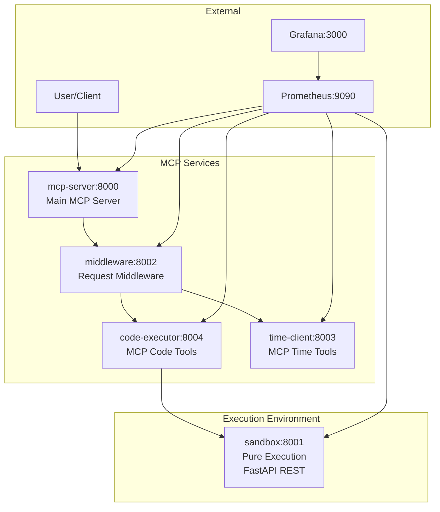
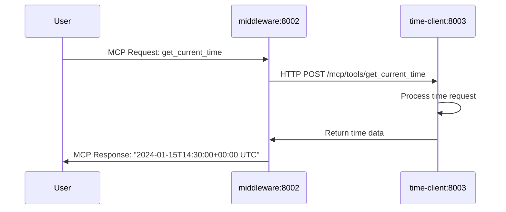
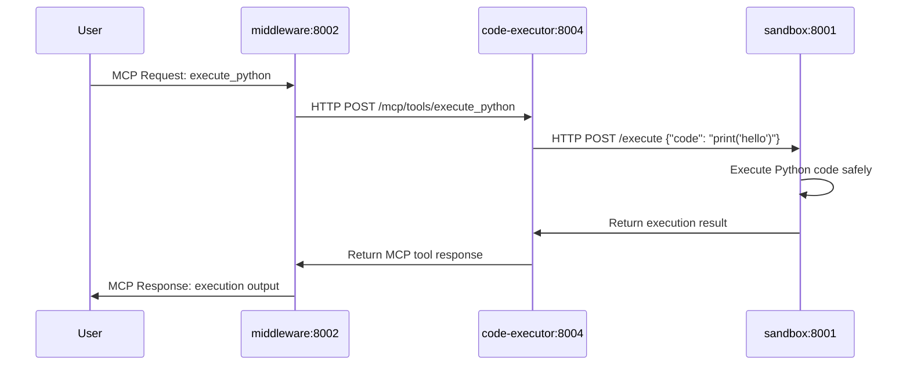

# System Architecture Documentation

## Overview

This MCP (Model Control Protocol) system consists of 5 microservices orchestrated via Docker Compose:

- **mcp-server** (port 8000): Main MCP server providing system coordination
- **middleware** (port 8002): Request processing and routing middleware  
- **sandbox** (port 8001): Pure code execution environment (FastAPI REST)
- **code-executor** (port 8004): MCP server providing code execution tools (delegates to sandbox)
- **time-client** (port 8003): MCP server providing time-related tools

Additional monitoring services:
- **Prometheus** (port 9090): Metrics collection
- **Grafana** (port 3000): Metrics visualization

## MCP Tools Available

### Time Tools (via time-client:8003)
- `get_current_time`: Returns current UTC time in ISO format
- `get_timezone_time`: Get time in specific timezone
- `format_time`: Format time strings

### Code Execution Tools (via code-executor:8004)
- `execute_python`: Execute Python code in sandboxed environment
- `install_package`: Install Python packages in sandbox
- `list_packages`: List installed packages

### System Tools (via mcp-server:8000)
- `get_system_status`: Get overall system health
- `get_service_metrics`: Get service performance metrics

## Architecture Flow



## Sequence Diagram: Time Query



## Sequence Diagram: Code Execution



## Service Communication

### MCP Protocol
- Standard MCP over HTTP between MCP-enabled services
- JSON-RPC 2.0 format for tool calls
- Automatic tool discovery and registration

### REST API (Internal)
- Sandbox uses pure FastAPI REST endpoints
- code-executor translates MCP calls to REST calls
- Prometheus metrics endpoints on all services

### Service Discovery
Services communicate via Docker Compose networking:
- `mcp-server:8000` - Main MCP endpoint
- `middleware:8002` - Request processing  
- `sandbox:8001` - Code execution
- `code-executor:8004` - MCP wrapper for sandbox
- `time-client:8003` - Time services

## Error Handling

### Code Execution Errors
- Syntax errors returned with traceback  
- Runtime exceptions captured safely
- Timeout protection (30s default)
- Memory limits enforced

### Service Failures
- Health checks on all services
- Graceful degradation when services unavailable
- Retry logic with exponential backoff
- Circuit breaker patterns

## Monitoring

### Metrics Collection
- Prometheus scrapes `/metrics` endpoints
- Custom metrics for tool usage, latency, errors
- System resource monitoring

### Visualization  
- Grafana dashboards for service health
- Real-time performance monitoring
- Error rate tracking and alerting

## Usage Examples

### Direct MCP Client
```python
import httpx

# Call time tool
response = httpx.post("http://localhost:8000/mcp/tools/get_current_time", 
                     json={"params": {}})

# Call code execution  
response = httpx.post("http://localhost:8000/mcp/tools/execute_python",
                     json={"params": {"code": "print('Hello, World!')"}})
```

### Health Checks
```bash
# Check all services
curl http://localhost:8000/health
curl http://localhost:8002/health  
curl http://localhost:8001/health
curl http://localhost:8004/health
curl http://localhost:8003/health

# View metrics
curl http://localhost:8000/metrics
``` 